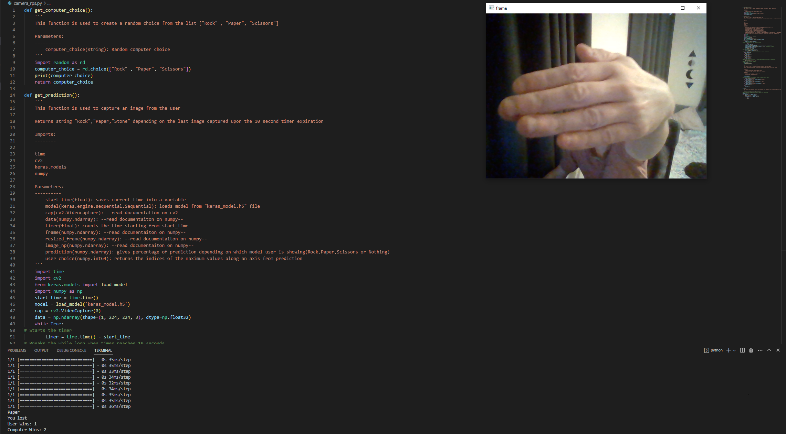
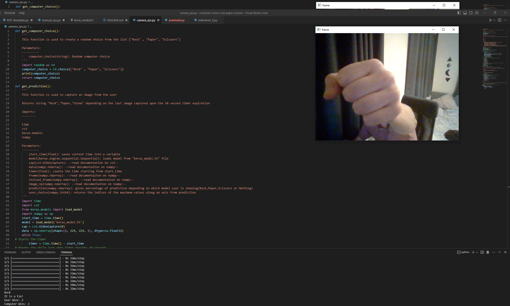
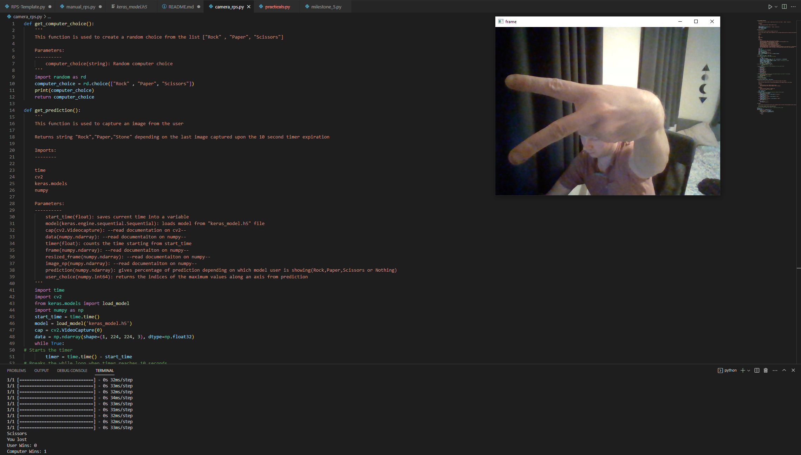

# Computer Vision RPS

Task: Create a game Rock Paper Scissors using computer vision system

## Rock Paper Scissors Game

Played between two people, in which each player simultaneously forms one of three shapes with an outstretched hand. These shapes are "rock" (a closed fist), "paper" (a flat hand), and "scissors" (a fist with the index finger and middle finger extended, forming a V).

it has three possible outcomes: a draw, a win or a loss. A player who decides to play rock will beat another player who has chosen scissors ("rock crushes scissors" or "breaks scissors" or sometimes "blunts scissors"), but will lose to one who has played paper ("paper covers rock"); a play of paper will lose to a play of scissors ("scissors cuts paper"). If both players choose the same shape, the game is tied and is usually immediately replayed to break the tie.

### Steps creating computer vision system using teachable machine project

* Teachable machine trains a computer to detect whether the user is showing Rock, Paper, Scissors to the camera.
* Creates 4 different classes: Rock, Paper, Scissors and Nothing
* Trains module using default parameters
    * Epochs : 50
    * Batch Size : 16
    * Learning Rate: 0.001
* Exporting model filename: keras_model.h5 which contains a structure and the parameters of deep learning model.
* Model will be used in a future project for game called Rock Paper Scissors where the user will be able to show his choice to the camera.
* Python Programming Language will be used in this projects

### Dependencies

* Python 3.8 Environment
* Conda environement packages installed
    * opencv-python
    * tensorflow
    * ipykernel
* Full details can be found in requirements.txt file

### Rock Paper Scissors game manual script information

*manual_rps.py file contains the skript for the game without the computer vision system. I'ts a manual version of the game where computer choice is made randomly and user inputs the choice manually*

* def_computer_choice function makes a random choice for computer and returns computer_choice as computers choice
* def_user_choice function asks user to choose Rock, Paper or Scissors and returns user_choice as user choice
* get_winner function has computer_choice and user_choice as attributes. Function contains main arguments. Checks who is a winner in a game and returns the string: 'I'ts a tie', 'You won!' or 'You lost' respectively.
* play function calls all the functions above 

### Rock Paper Scissors game using model learned and captured in a file keras_model.h5

* def_computer_choice function makes a random choice for computer and returns computer_choice as computer_choice
* def_prediction function uses keras_model.h5 learned model to campture an image from a player and return a string if user is showin Rock, Paper or Scissors. If player shows nothing then preductions are made again. There is 10 seconds timer for each try.
* get_winner function has computer_choice and user_choice as attributes. Function contains main arguments. Checks who is a winner in a game and returns the string: 'I'ts a tie', 'You won!' or 'You lost' respectively. Depending on how many times player or computer won counts amount of wins for both.
* Loops the game until computer or player has 3 wins in total

Testing Examples with terminal returns:

